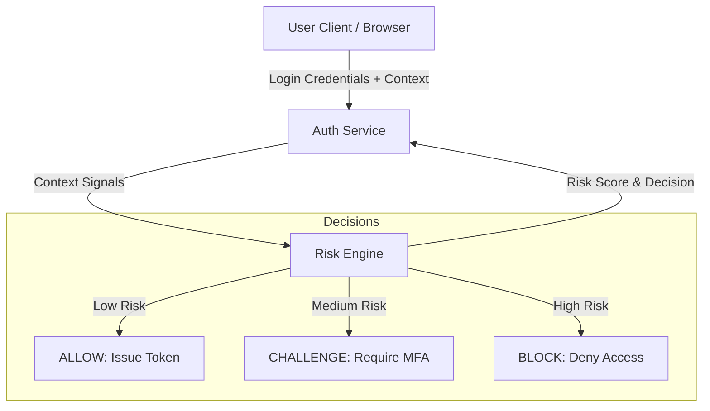

# Context-Aware Adaptive Authentication System

## 1. High-Level Architecture

The system augments the traditional username/password flow with a **Risk Engine** that evaluates every request context.

### Components
1.  **Auth Service**: Entry point for user credentials. It collects "Context Signals" from the request (IP, Device Fingerprint, User Agent, Timestamp).
2.  **Risk Engine**: The brain of the security layer. It compares current signals against the user's historical profile and global rules.

## 2. Risk Evaluation Logic

The Risk Engine calculates a **Risk Score (0-100)** based on weighted signals.

### Key Factors
| Factor | Description | Weight (Example) |
| :--- | :--- | :--- |
| **New Device** | Device ID not seen in user history. | +30 |
| **Impossible Travel** | Login location distance / time > realistic speed. | +80 |
| **IP Reputation** | Known bad IP or Tor exit node. | +50 |
| **Velocity** | Too many attempts in short time. | +40 |
| **ML/Anomaly** | Unsupervised model flags event as outlier. | +35 |

### Hybrid Approach (Rules + ML)
The final risk score is a combination of:
1.  **Deterministic Rules**: Explicit violations (velocity, blacklist).
2.  **Probabilistic ML**: Behavioral anomalies (e.g., user suddenly logging in at 3 AM from a new OS version, which individually might be fine but together are odd).

### Thresholds
- **Low Risk (0-20)**: **Frictionless**. Standard login succeeds immediately.
- **Medium Risk (21-70)**: **Step-up**. Request 2FA/OTP.
- **High Risk (>70)**: **Block**. Reject login, alert support.

## 3. Security vs. Friction

### How we improve Security
- **Credential Stuffing Defense**: Even if an attacker has the password, they likely don't have the user's device or typical IP/Location profile. This triggers a specific challenge or block.
- **Session Protection**: We can re-evaluate risk on sensitive actions (e.g., "Change Password") using the same engine, not just at login.

### Handling Friction
- **The "Happy Path"**: A user logging in from their company laptop at their usual office gets **ZERO** additional friction. No 2FA prompt every single time.
- **Justified Friction**: Users only see extra steps when *we* are unsure. Most users accept a 2FA prompt when logging in from a new phone or a coffee shop in a different city as a reasonable security measure.
